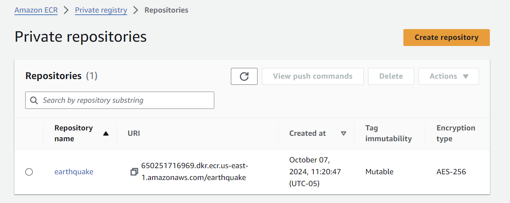
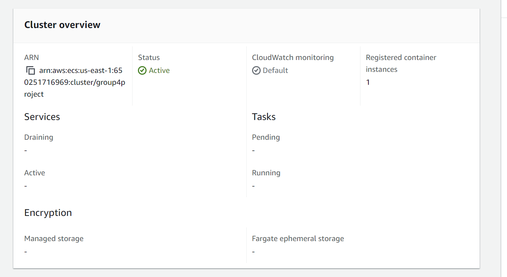
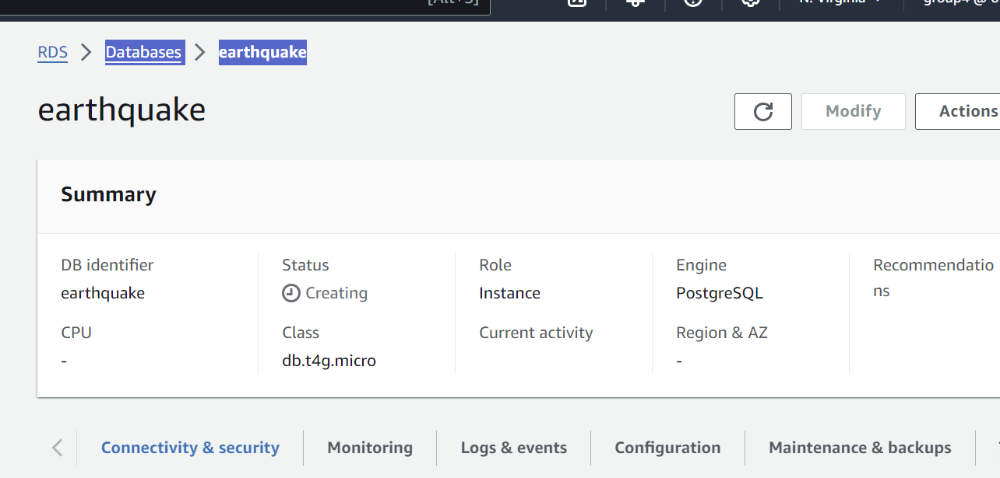
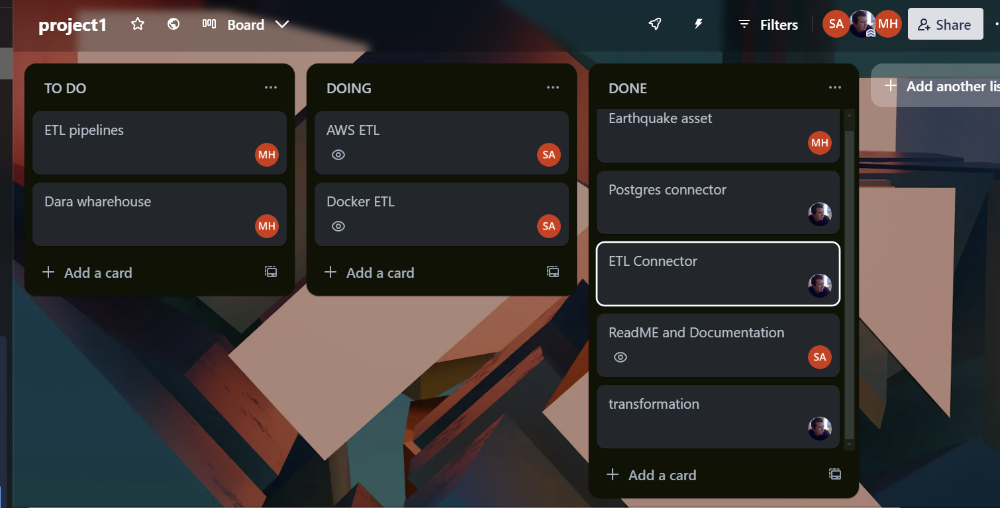

# Group4project1 - USGS Earthquakes API Ingestion and Transformation

## Objective

The objective of this project is to create a data pipeline solution that is capable of looking up accurate real-time and historical data about earthquake events globally. This data includes information such as event magnitude, location (latitude/longitude), depth, time of occurrence, and other seismic event attributes. The goal of this project is to build a robust ETL (Extract, Transform, Load) pipeline to facilitate seamless integration, processing, and analysis of this earthquake data for research, monitoring, and risk assessment.

Earthquake API (https://earthquake.usgs.gov/fdsnws/event/1)


## Consumers

Users who would find our datasets useful include:
*  Seismologists and Geologists: To Analyze seismic activity patterns, study tectonic plate movements, and develop models to predict earthquake behavior.
*  Disaster Management Agencies: To Monitor real-time earthquake events to coordinate emergency responses and disaster relief efforts.
*  Urban Planners and Engineers: To Evaluate seismic risk when planning infrastructure projects, construction standards, and building codes.
*  Insurance Companies and Risk Assessors: Use Case: Assess earthquake risk in specific regions to model potential losses and calculate insurance premiums.
*  Government and Regulatory Bodies: To Monitor seismic activity for regulatory compliance and safety standards.
*  Academic and Research Institutions: To Conduct research on seismic phenomena, geophysics, and earth sciences.
*  Utility Companies: To Assess risk to critical infrastructure such as power plants, water facilities, and pipelines.

## Questions

Our data addresses questions like

- How many earthquakes occur each day, week, month, and year?
- Which regions or countries experience the highest frequency of earthquakes?
- What are the distribution patterns of earthquake magnitudes over time?
- Which tectonic plate boundaries experience the most seismic activity?
-What countries or regions have seen a significant increase in earthquake occurrences    over time?
-Which regions have the highest potential risk based on historical earthquake data?
-How frequently do large magnitude (7.0+) earthquakes occur in high-population areas?
-What are the economic or infrastructural impacts of earthquakes in high-risk zones?

 These questions and use cases guide the ETL pipeline development, ensuring it delivers the insights and analytics needed by each user group.

## Source datasets

Primary Dataset: USGS Earthquake Catalog API (https://earthquake.usgs.gov/fdsnws/event/1)

Description: This dataset provides real-time and historical data on global earthquake events.

## Solution architecture


This data solution is based on an ingestion and trasnformation pipeline. 
These are supported by 2 docker containers, along with a 3rd container for the Postgres database which houses the ingestion results and subsequent transformations.

## Underlying Architecture

### Python :

* For extracting data from both live sources.
* Loading data to postgres database.
* Setting up scheduled refreshes.

### PostgreSQL DBMS:
* Stores the live data and associated transformations

### AWS RDS (if needed):
* Hosts and manages postgres database.

### Other tools used:
* Docker: containerized pipelines and database.
* ECR: hosts the docker containers -optional.
* ECS: runs the docker containers -optional.
* S3: stroing the .env file -optional.


## On-Prem Installation Instructions

### 1. Install PostgreSQL and Python
  Download PostgreSQL and pgAdmin by going to https://www.postgresql.org/download/ and selecting the installer for your Operating System. Download the latest version of PostgreSQL.
### 2. Clone the repo
  Clone the github repository or manually download it.
### 3. After navigating to the directory containing the docker-compose.yml file, run the following command in terminal: 
```docker compose up```
  

AWS Screenshots
We use Docker to contain the pipeline, then load it into AWS ECR, and run on ECS.

AWS ECR 



AWS ECS
Screenshot of task running:



# AWS RDS screenshot


## Breakdown of tasks




